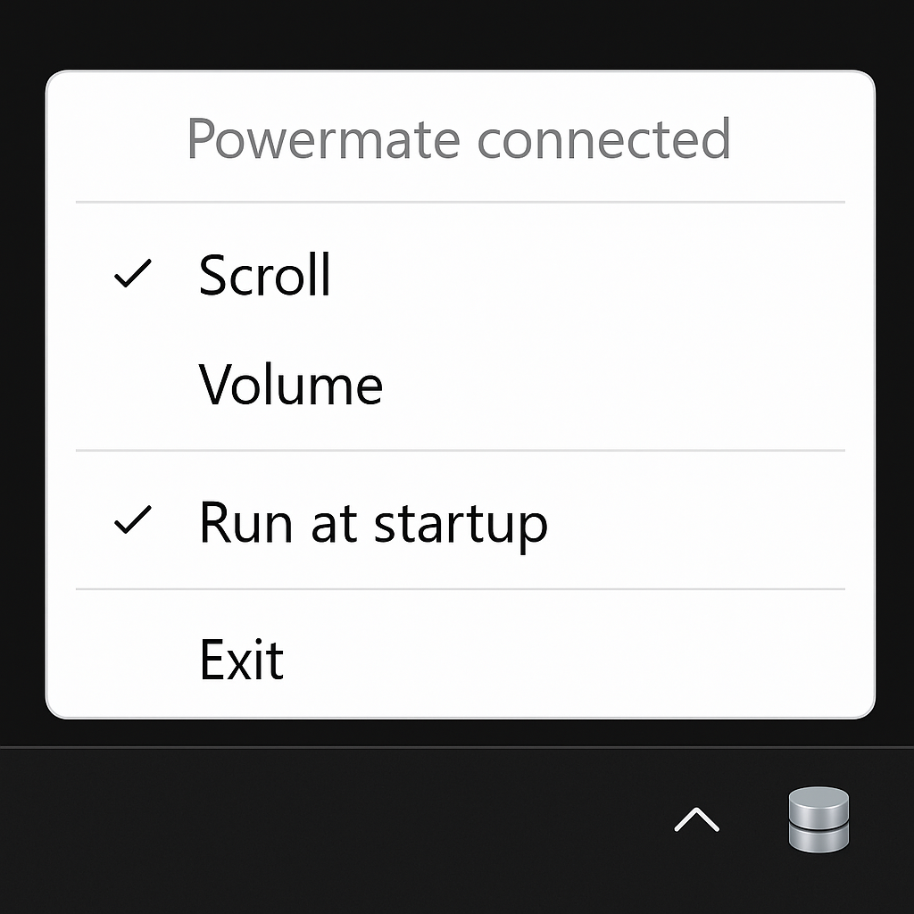

  
  <h3 align="center">PowerMateControl</h3>

  

    Windows 11 tray application for the Griffin PowerMate USB device
     
    Control Windows volume or simulate mouse scroll action.
  

---

PowerMateControl is a Windows system tray application designed for Windows 11.  
It provides functionality for the Griffin PowerMate USB device. There is no plans to support the Bluetooth version.
<table>
  <tr>
    <td>
      
    </td>
    <td style="text-align: left; vertical-align: width: 45%;">
      
This program offers two distinct profiles:

      <ul>
        <li><strong>Scroll</strong>: Sends mouse scroll actions.</li>
        <li><strong>Volume</strong>: Controls the system volume.</li>
      </ul>
    </td>
  </tr>
</table>